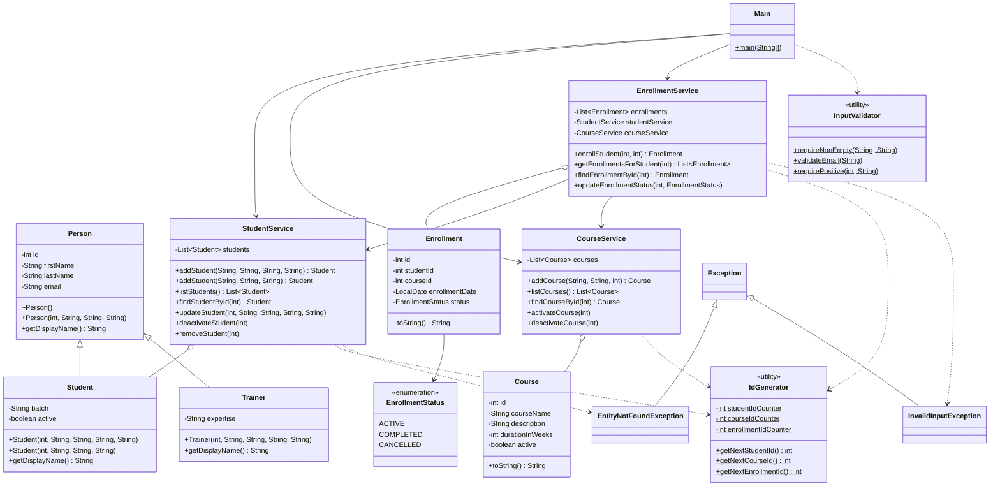

# LearnTrack

LearnTrack is a console-based **Student & Course Management System** written in Core Java.
An admin can manage **students**, **courses** and **enrollments** from a menu in the terminal.
All data is kept in memory (`ArrayList`), so it resets every time the program restarts.

The project practises Java fundamentals: classes and objects, constructors, encapsulation,
inheritance, method overriding and overloading, static members, collections, enums and
exception handling. Code is split into entity, service and UI layers.

## Features

| # | Menu option | What it does |
|---|---|---|
| 1 | Add student | Adds a student after validating name, email and batch |
| 2 | List students | Shows all students with their status |
| 3 | Find student by id | Shows one student, or an error if the id does not exist |
| 4 | Update student | Changes name, email and batch of an existing student |
| 5 | Deactivate student | Sets `active = false` instead of deleting the student |
| 6 | Add course | Adds a course after validating name, description and duration |
| 7 | List courses | Shows all courses with their status |
| 8 | Activate/Deactivate course | Switches a course between ACTIVE and INACTIVE |
| 9 | Enroll student in course | Enrolls a student, only if both are active and not already enrolled |
| 10 | View enrollments for student | Lists all enrollments of one student |
| 11 | Update enrollment status | Marks an enrollment as ACTIVE, COMPLETED or CANCELLED |
| 0 | Exit | Closes the program |

Invalid input never crashes the program: wrong menu options, text instead of numbers,
empty fields, invalid emails and unknown ids all show a clear message.

## Requirements

- JDK 17 or newer (developed and tested with **Oracle JDK 24.0.1**)

## How to compile and run

### Terminal (from the project root)

```bash
javac -d out $(find src -name "*.java")
java -cp out com.mohammadahtisham.learntrack.ui.Main
```

- `javac -d out` compiles every `.java` file and writes the `.class` files into `out/`.
- `java -cp out` starts the JVM with `out/` on the classpath and runs the `Main` class by its fully qualified name.

### IntelliJ IDEA

Open the project, open `src/com/mohammadahtisham/learntrack/ui/Main.java` and click the green ▶ next to `main`.

## Sample session

```text
===== LearnTrack =====
1. Add student
...
0. Exit
Enter choice: 6
Course name: Java Basics
Description: Core Java
Duration (weeks): 6
Course added with id 1
Enter choice: 1
First name: Ali
Last name: Khan
Email: ali@test.com
Batch: Jan-2026
Student added with id 1
Enter choice: 9
Student id: 1
Course id: 1
Enrolled with enrollment id 1
Enter choice: 10
Student id: 1
1 | Student: 1 | Course: 1 | 2026-10-04 | ACTIVE
Enter choice: 3
Student id: 99
Error: Student with id 99 not found
Enter choice: abc
Please enter a number.
Enter choice: 0
Goodbye!
```

## Project structure

```text
src/com/mohammadahtisham/learntrack/
├── entity/       Person, Student, Trainer, Course, Enrollment, EnrollmentStatus
├── service/      StudentService, CourseService, EnrollmentService
├── ui/           Main (menu, reading input, printing results)
├── exception/    EntityNotFoundException, InvalidInputException
└── util/         IdGenerator, InputValidator
docs/
├── Setup_Instructions.md
├── JVM_Basics.md
└── Design_Notes.md
```

| Layer | Responsibility |
|---|---|
| `entity` | Holds data (private fields, getters/setters). No business logic. |
| `service` | Business rules: storing in `ArrayList`, finding by id, validation of state (e.g. inactive course). |
| `ui` | Shows the menu, reads input, calls services, prints results and error messages. |
| `exception` | Custom checked exceptions with clear messages. |
| `util` | Static helpers: unique ids and input validation. |

## Class diagram



**How to read it:** `<|--` is inheritance, `o--` means a service holds a list of those objects,
`-->` means "uses / has a reference to", and `..>` means "depends on" (calls a static method or throws).
`$` marks static members, `-` private, `+` public and `~` package-private (default access).

## Documentation

- [Setup Instructions](docs/Setup_Instructions.md): JDK version, Hello World compile and run
- [JVM Basics](docs/JVM_Basics.md): JDK vs JRE vs JVM, bytecode, write once run anywhere
- [Design Notes](docs/Design_Notes.md): ArrayList vs array, static members, inheritance

## Known limitations

- Data is in memory only and is lost when the program exits.
- Ids are generated by simple static counters (not thread-safe, which is fine for a single-user console app).
- `Trainer` exists to demonstrate inheritance and is not used in the menu yet.
